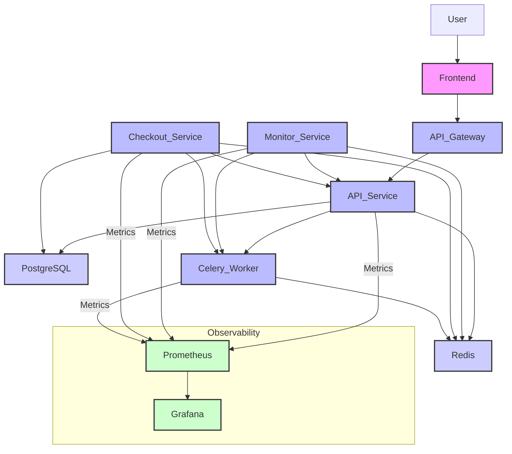

# Architecture

## Overview

The Sneak 'n Snipe bot is built on a microservices architecture, with a React-based frontend and a suite of Python backend services. The services are designed to be highly available and scalable, and they communicate with each other using a combination of REST APIs and a Redis-based message queue.

## Architecture Diagram

## Services

- **Frontend**: A React-based UI for managing tasks, profiles, and proxies.
- **API Gateway**: A FastAPI-based service that provides a single entry point for all API requests.
- **Monitor Service**: A Python service that monitors sneaker release sites for new products.
- **Checkout Service**: A Python service that processes checkouts.
- **Proxy Service**: A Python service that manages a pool of proxies for use by the other services.
- **Captcha Service**: A Python service that solves CAPTCHAs.
- **Celery Worker**: A Celery-based worker that processes asynchronous tasks.

## Infrastructure

- **Docker Compose**: Used for local development and testing.
- **Prometheus**: Used for collecting metrics from the backend services.
- **Grafana**: Used for visualizing metrics from Prometheus.
- **Redis**: Used as a message queue and for caching.
- **PostgreSQL**: Used for persistent storage.